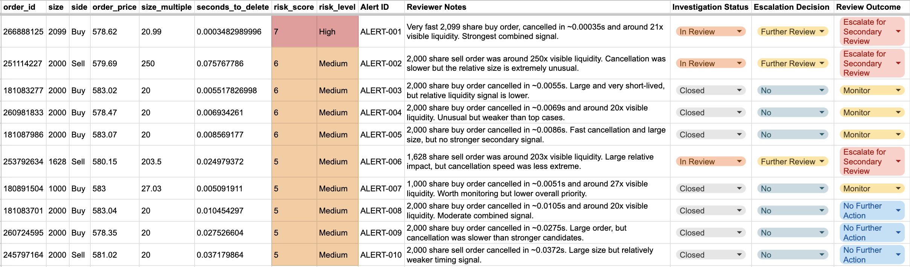

# Market Abuse Surveillance Analytics

A market-surveillance case study using SQL, Python, spreadsheet investigation workflows and Tableau to identify and prioritise unusual AAPL order-book activity.

## Dashboard

## Business Problem

How can order-book event data be used to identify potentially suspicious trading patterns that may warrant further market-abuse investigation?

## Tools

- SQL
- Python
- Google Sheets
- Tableau

## Dataset

AAPL LOBSTER sample order-book and message data for 21 June 2012.

The dataset contains order submissions, cancellations, deletions and executions alongside five levels of order-book depth.

## Surveillance Approach

The analysis focused on identifying unusual order behaviour using a combination of:

- unusually large order size
- very short cancellation time
- order size relative to visible best-side liquidity
- transparent surveillance-priority scoring
- manual secondary-review decisions

An alert is treated as a reason for further investigation, not evidence that market abuse occurred.

## Key Findings

- 143,822 new orders were observed.
- Average new-order size was approximately 90 shares.
- Rapid cancellation was common, meaning cancellation speed alone was not sufficient to identify suspicious activity.
- 46 orders met the combined large-order and fast-cancellation surveillance threshold.
- The highest-priority candidate was a 2,099-share buy order cancelled in approximately 0.00035 seconds.
- That order was approximately 20.99× the visible best-side liquidity.
- Some flagged orders exceeded 200× the visible top-of-book liquidity.

## Investigation Workflow

The top surveillance candidates were reviewed using a structured spreadsheet investigation log containing:

- alert ID
- reviewer notes
- investigation status
- escalation decision
- review outcome

The strongest cases were escalated for secondary review rather than labelled as confirmed market abuse.

### Investigation Review Log

## Limitations

This dataset does not contain client or participant identifiers.

As a result, the analysis cannot establish trader intent, link activity across accounts, or prove spoofing or other forms of manipulation.

A real investigation would require additional client-level trading data, linked orders, executions, market context and supporting evidence.

## AI Use

AI tools were used selectively for learning support, debugging and refining parts of the workflow.

All analysis steps, outputs and conclusions were reviewed and checked before being included in the final project.

## Interactive Dashboard

The Tableau dashboard provides an interactive view of surveillance candidates, cancellation speed, relative visible liquidity and risk prioritisation.

[View the interactive Tableau dashboard](https://public.tableau.com/app/profile/salma.sadiki.aalouane/viz/MarketAbuseSurveillanceAnalyticsAAPLOrder-BookInvestigation/Dashboard1?publish=yes)

## Project Structure

### 1. Data Preparation
- `01_data_cleaning.sql` — data preparation and field interpretation

### 2. Exploratory Analysis
- `02_exploratory_analysis.sql` — event behaviour, cancellation patterns and order-size baselines

### 3. Surveillance Detection
- `03_surveillance_detection.sql` — identification of large, rapidly cancelled orders

### 4. Case Investigation
- `04_case_investigation.sql` — order-book context and prioritisation logic

### 5. Python Prioritisation
- `market_abuse_surveillance.ipynb` — risk labelling, ranking and visual analysis
- `top_10_surveillance_candidates.csv` — final prioritised surveillance cases

### 6. Investigation Workflow
- `investigation_log.png` — spreadsheet-based review, escalation and outcome tracking

### 7. Dashboard & Presentation
- `market_abuse_dashboard.png` — final Tableau dashboard preview
- Tableau Public — interactive dashboard
